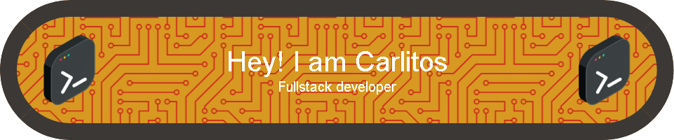

<!-- // CONTADOR DE VISITAS // -->

 
<!-- // MENSAJE DE BIENVENIDA // -->

# ¡Hola 👋! Soy Carlos Calderón, ¡me alegra verte aquí!

<!--- // ----- // ----- // REDES SOCIALES: INICIO // ----- // ----- //--->

### Mis redes sociales

<a href="https://www.tiktok.com/@learnwithcarlitos" target="_blank">
  
<a href="https://www.twitch.tv/learnwithcarlitos" target="_blank">
  
<a href="https://x.com/LearnWCarlitos" target="_blank">
  
<a href="https://www.youtube.com/@DevelopingWithCarlitos" target="_blank">
  
<a href="https://www.linkedin.com/in/learnwithcarlitos/" target="_blank">
  

<!--- // ----- // ----- // REDES SOCIALES: FIN // ----- // ----- //--->

 

<!--- // ----- // ----- // SOBRE MÍ: INICIO // ----- // ----- //--->

### Sobre mí

Soy Ingeniero de Sistemas apasionado por la tecnología, los deportes y las matemáticas. Desde joven, he estado inmerso en el mundo de la programación y el desarrollo de software, siempre buscando mejorar mis habilidades y conocimientos en este campo.

  
  
  
  
  
  
  
  
  
  
  
  
  
  
  

 

### Mis metas

Mis objetivos principales son:

- Aprender inglés para comunicarme mejor en un entorno global.
- Optimizar mi trabajo como programador.

Creo firmemente en la importancia del aprendizaje continuo y la mejora constante en cualquier profesión, y me esfuerzo día a día para alcanzar estas metas.

### Experiencia profesional

A lo largo de mi carrera, he trabajado en diversos proyectos, desde aplicaciones web hasta soluciones de software personalizadas. Siempre me enfoco en escribir código limpio y eficiente que resuelva problemas de manera efectiva.

### Contacto

¡Estoy siempre abierto a nuevas oportunidades y colaboraciones! No dudes en contactarme si quieres discutir ideas, proyectos o simplemente charlar sobre tecnología y programación.

<!--- // ----- // ----- // SOBRE MÍ: FIN // ----- // ----- //--->

<!--- // ----- // ----- // DATOS RÁPIDOS: INICIO // ----- // ----- //--->

# Datos rápidos

- 🔭 Actualmente, soy creador de contenido en [Mi Canal](https://www.youtube.com/@DevelopingWithCarlitos).

- 📝 Estoy esforzándome para obtener un certificado internacional de inglés (TOEFL o IELTS).

<!--- // ----- // ----- // DATOS RÁPIDOS: FIN // ----- // ----- //--->

<!--- // ----- // ----- // HABILIDADES: INICIO // ----- // ----- //--->

 

## My Skill Set (Tecnología)

<table>
<tr>
<td valign="top" width="33%">

### Languages
  

    
    
    
    
    
    
    
    
  

</td><td valign="top" width="33%">

### Technologies

  
  
  
  
  
  
  

</td><td valign="top" width="33%">

### DevOps

  
  

</td>
</tr>
</table>

<!--- // ----- // ----- // HABILIDADES: FIN // ----- // ----- //--->

 

## My Skill Set (Area)
<table>
<tr>
<td valign="top" width="33%">

### Frontend
  

    
    
    
    
    
    
    
    
  

</td>

<td valign="top" width="33%">

### Backend

  
  
  
  
  
  
  
  

</td>

<td valign="top" width="33%">

### DevOps

  
  

</td>
</tr>
</table>

 

<!--- // ----- // ----- // GITHUB STATS: INIT // ----- // ----- //--->

# Github Stats

  

    
  

   
  

    
  

   
  

    
  

   
  

    
  

<!--- // ----- // ----- // GITHUB STATS: FINISH // ----- // ----- //--->

 

